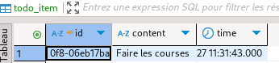

# TP MIAGE conception logicielle

Rebours Julien

Commentaires éventuels des étudiants : Aucun

## Pré-requis 

* Disposer d'**une machine dotée d'au moins 8 Gio** de RAM avec 20 Gio de disque disponible ; **Un PC par binôme suffit**, choisir le plus puissant (avec le plus de RAM).
* Disposer d'une **connexion internet hors université** pendant le TP (le réseau de l'université semble bloquer un certain nombre de choses). En cas d'urgence, je peux fournir de la data en 5G.
* Disposer d'**un compte Github par personne** et avoir https://docs.github.com/en/authentication/keeping-your-account-and-data-secure/creating-a-personal-access-token[créé un access token] avec le groupe de droits `repo`, le faire depuis https://github.com/settings/tokens[ici];
* Avoir téléchargé et testé la VM (voir plus bas) ou disposer de tous les outils AVANT le TP.

WARNING: VirtualBox semble mal fonctionner (très lent) sur OSX. Si vous êtes sur un Mac, bien tester avant le TP. Il est illusoir de penser avoir le temps d'installer et configurer les outils pendant le TP.

## Environnement de développement

Deux options sont possibles :

### Option 1 (fortement recommandée) - Utiliser la VM fournie

Télécharger, décompresser et *tester* cette https://public.florat.net/cours_miage/vm-tp-miage.ova[image VirtualBox] *avant le TP*. Elle contient tous les outils nécessaires (Intellij IDEA, DBeaver, client REST Bruno, Firefox...).

**Le login/mot de passe est : `vagrant`/`vagrant`.**

NOTE: Cette VM est issue de ce https://github.com/bflorat/vm-dev[projet open source].

IMPORTANT: Si pas déjà fait, activer les fonctions de virtualisation CPU dans votre BIOS/UEFI (option `AMD-V` ou `Intel VT` en général).

### Option 2 - Installer les outils soit même sur votre machine

* Disposer d’un IDE (de préférence Intellij IDEA CE, Eclipse ou VSCode) et un JDK 17+.
* Disposer d’une installation de Docker.
* Disposer d’un client de test REST (Bruno, Insomnia ou Postman conseillés).
* Disposer d’un explorer de base de donnée (DBeaver conseillé).

WARNING: Si vous choissiez cette option, vous êtes en autonomie sur l'installation et la configuration des outils.

## Déroulement du TP

* Répondre aux questions de la feuille de TP juste sous la question (en modifiant, commitant puis poussant le fichier `README.adoc`).

Nous fournissons différents projets IDEA servant de base de travail aux exercices suivant. Cela permet un point de synchronisation de tous les étudiants à différents moments du TP.

IMPORTANT: Vous ne pourrez pas faire de `push` avec votre mot de passe (Github n'autorise plus que les access tokens), veuillez utiliser login/<access token> (voir pré-requis plus haut pour le créer).

### Exercice 1 - Etudier une API REST sans couches
_Temps estimé : 40 mins_

* Importer dans IDEA les projets depuis le VCS (URL : `https://github.com/<x>/tp-miage-2025.git`.

TIP: [Rappel Git] Trois dépôts sont ici utilisés : le dépot Github de l'enseignant (`bflorat/tp-miage-2025`), le dépot Github du binôme (`<x>/tp-miage-2025`), le dépot local sur le portable de l'un ou des deux étudiants du binôme.

* Observer le code du projet `todolist-debut-ex1`

*Le code est-il structuré en couches ? Quel problèmes ce code peut-il poser ?*

Ce code est bien structuré en couches, mais pas de manière rigoureuse. Il mélange notamment la logique métier (comme l'ajout de [LATE!] si une tâche a plus de 24h) directement dans le contrôleur, ce qui va à l’encontre des bonnes pratiques. Il manque donc une couche service pour isoler la logique métier et améliorer la maintenabilité.

De plus, la classe TodoItem est utilisée à la fois comme entité JPA et comme DTO exposé par l’API, ce qui peut poser des problèmes à terme (risques d’exposition de données sensibles ou inutiles, difficulté à faire évoluer l’API).

Il n’y a pas non plus de validation des données ni de gestion centralisée des erreurs, ce qui peut rendre l’API fragile face à de mauvaises requêtes. Enfin, le code ne semble pas inclure de tests, ce qui limite la vérifiabilité du comportement attendu.

*Où se trouve le code métier (voir la règle de gestion RG 1) ?*

Le code métier est implémenté dans la méthode finalContent(TodoItem item) de la classe TodoListController ce qui n'est aps l'ideal comme vu précedemment, il serait preferable de le mettre dans une couche service.

*Cette règle est-elle facilement testable par un test unitaire ?*

Non, la règle n'est pas facilement testable dans sa version actuelle, car elle est dans le contrôleur.
Elle le serait si elle était déplacée dans une couche service, sous forme d'une méthode pure, isolée et testable indépendamment.

* Lancer une base PostgreSQL en Docker dans un terminal (on lance ici la base en mode interactif pour visualiser son activité. Pour la lancer en tâche de fond, remplacer les options `it` par `d` comme 'daemon'):
```bash
docker run -it -e POSTGRES_PASSWORD=password -p 5432:5432 postgres
```
*Expliquer cette ligne de commande (y compris les options utilisées)*

* docker run : Lance un nouveau conteneur basé sur une image spécifiée.
-it :
-i (interactive) : Maintient l'entrée standard (stdin) ouverte pour interagir avec le conteneur.
-t (pseudo-TTY) : Alloue un terminal virtuel, utile pour interagir avec le conteneur.

* -e POSTGRES_PASSWORD=password :
Définit une variable d'environnement à l'intérieur du conteneur.
POSTGRES_PASSWORD est utilisé par l'image officielle PostgreSQL pour définir le mot de passe de l'utilisateur postgres.
Ici, le mot de passe est password 

* -p 5432:5432 :
Configure le mappage des ports entre la machine hôte et le conteneur.
5432:5432 signifie que le port 5432 du conteneur (port par défaut de PostgreSQL) est exposé et accessible via le port 5432 de l'hôte.

* postgres :
Spécifie l'image Docker à utiliser.
S'il n'est pas déjà présent localement, Docker va télécharger l'image officielle PostgreSQL depuis Docker Hub.

* Compléter le code manquant dans la méthode `TodoListController.createTodoItem()`

Fait 

*Pourquoi `todoItemRepository` est-il `null` ? Quelle est la meilleure façon de l'injecter ?*

Le `todoItemRepository` est `null` car nous ne l'avons pas initialisé. Pour ce faire nous allons l'injecter de manière automatique via @Inject ou @Autowired

* Modifier le code en conséquence.

Dans notre cas nous avons choisi @Inject

* Tester vos endpoints avec un client REST.


[NOTE]
====
* Les URL des endpoints sont renseignées dans le contrôleur via les annotation `@...Mapping` 
* Exemple de body JSON : 

```json
{
    "id": "0f8-06eb17ba8d34",
    "time": "2020-02-27T10:31:43Z",
    "content": "Faire les courses"
  }
```
====

NOTE: Pour lancer l'application Spring, sélectionner la classe `TodolistApplication` et faire bouton droit -> 'Run as' -> 'Java Application'.

* Quand le nouveau endpoint fonctionne, commiter, faire un push vers Github.

* Vérifier avec DBeaver que les données sont bien en base PostgreSQL.



### Exercice 2 - Refactoring en architecture hexagonale
_Temps estimé : 1 h 20_

* Partir du projet `todolist-debut-ex2`

NOTE: Le projet a été réusiné suivant les principes de l'architecture hexagonale : 

image::images/archi_hexagonale.png[]
Source : http://leanpub.com/get-your-hands-dirty-on-clean-architecture[Tom Hombergs]

* Nous avons découpé le coeur en deux couches : 
  - la couche `application` qui contient tous les contrats : ports (interfaces) et les implémentations des ports d'entrée (ou "use case") et qui servent à orchestrer les entités.
  - la couche `domain` qui contient les entités (au sens DDD, pas au sens JPA). En général des classes complexes (méthodes riches, relations entre les entités)

*Rappeler en quelques lignes les grands principes de l'architecture hexagonale.*

L’architecture hexagonale, a été conçue pour isoler le cœur métier d’une application de ses interfaces techniques (web, base de données, systèmes externes, etc.). Voici ses grands principes :

Indépendance du domaine métier : le cœur de l'application ne dépend d'aucune technologie. Il contient la logique métier, modélisée à travers des entités riches.

Couche application : elle orchestre les cas d’usage à l’aide de ports d’entrée que les adaptateurs appellent pour initier des actions. Cette couche contient aussi les ports de sortie, utilisés pour interagir avec les systèmes externes (BDD, APIs...).

Ports et adaptateurs :

Les ports sont des interfaces définies côté application.

Les adaptateurs implémentent ces interfaces pour permettre la communication entre le monde extérieur et le cœur métier.

Inversion des dépendances : les dépendances vont du périphérique vers le centre. Le domaine métier ne connaît pas les technologies, mais les utilise via des abstractions (interfaces).

Testabilité et maintenabilité : en rendant le domaine métier indépendant de la technique, il devient plus facile à tester et à faire évoluer.

Cette architecture favorise un découplage fort entre la logique métier et les détails d’implémentation, rendant l’application plus souple, maintenable et facilement testable.

Compléter ce code avec une fonctionnalité de création de `TodoItem`  persisté en base et appelé depuis un endpoint REST `POST /todos` qui :

* prend un `TodoItem` au format JSON dans le body (voir exemple de contenu plus haut);
* renvoie un code `201` en cas de succès. 

La fonctionnalité à implémenter est contractualisée par le port d'entrée `AddTodoItem`.

### Exercice 3 - Ecriture de tests
_Temps estimé : 20 mins_

* Rester sur le même code que l'exercice 2

* Implémenter (en junit) des TU portant sur la règle de gestion qui consiste à afficher `[LATE!]` dans la description d'un item en retard de plus de 24h.

*Quels types de tests devra-t-on écrire pour les adaptateurs ?* 

* Web Adapter : 

Test de Controller 

Objectifs :

Vérifier que les requêtes HTTP sont correctement transformées en appels aux ports d’entrée (use cases).

S’assurer que les bons codes HTTP sont renvoyés (200, 201, 400, 404, etc.).

Valider la sérialisation / désérialisation JSON <-> objets Java.

Tester les paramètres de requête, les corps de requête, les valeurs de retour.

* Persistence adapter : 

Test de Mapping

Objectifs :

Vérifier que les entités JPA (ou autre ORM) sont correctement mappées vers les entités métier.

Tester les opérations CRUD réelles sur une base (souvent en mémoire comme H2).

S’assurer que les requêtes personnalisées renvoient les bonnes données.

* External System Adapter : 

Test d'intégration

Objectifs :

S’assurer que l’adaptateur sait consommer un service externe (HTTP, messaging…).

Vérifier les erreurs de communication (timeout, 404…).

Simuler le comportement du service externe.

*S'il vous reste du temps, écrire quelques-uns de ces types de test.*

[TIP]
=====
- Pour tester l'adapter REST, utiliser l'annotation `@WebMvcTest(controllers = TodoListController.class)`
- Voir cette https://spring.io/guides/gs/testing-web/[documentation]
=====


